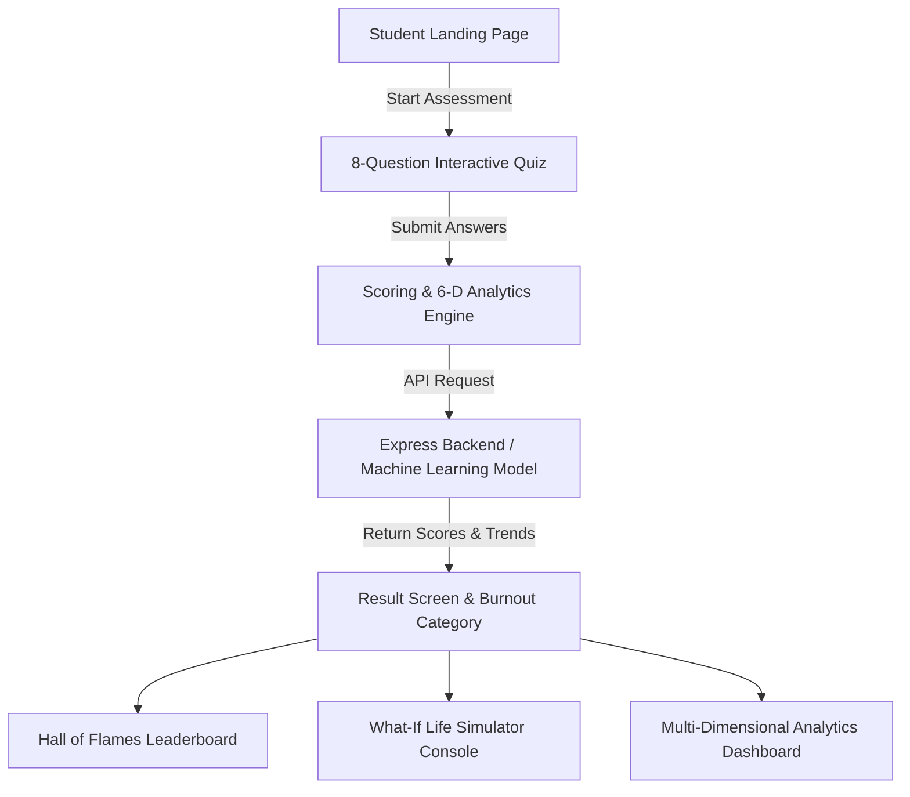

# 🔥 HOW COOKED ARE YOU? — Scientific Student Assessment

## Team Name: Blue Pill

### Team Members
- **Team Lead:** Avanesh R - NSS College Of Engineering
- **Member 2:** Christy Sebastian - NSS College Of Engineering

---

## Project Description
A full-stack student assessment and burnout analytics web application. It calculates your exact "Cooked Percentage" based on sleep, study hours, reels scrolled, pending assignments, and exam pressure using deterministic scoring algorithms and machine learning risk predictions.

---

## The Problem (that doesn't exist)
Students facing sudden existential panic at 3 AM have no scientific, quantifiable metric to measure exactly how cooked, toasted, or deep-fried their academic life actually is before upcoming exams.

---

## The Solution (that nobody asked for)
A multi-dimensional 6-index diagnostic system paired with a real-time What-If Life Simulator, 7-day/30-day trajectory forecasting, and a global Hall of Flames leaderboard so students can gamify their academic burnout with extreme precision.

---

## Technical Details

### Technologies/Components Used

#### For Software:
- **Languages used:** JavaScript (ES6+ HTML5, CSS3)
- **Frameworks used:** React 19, Express.js (Node.js backend)
- **Libraries used:** Vite, Lucide React, Canvas-Confetti, BcryptJS, JSONWebToken, CORS
- **Tools used:** Vite Dev Server, Oxlint, Node.js

---

## Implementation

### For Software:

#### Installation
```bash
# Clone the repository
git clone https://github.com/your-username/How_cooked_are_you.git
cd How_cooked_are_you

# Install project dependencies
npm install
```

#### Run
```bash
# Start Express Backend API (Port 5000)
node backend/server.js

# Start Vite Frontend Dev Server (Port 5173)
npm run dev
```

---

## Project Documentation

### For Software:

#### Screenshots


The redesigned landing page of How Cooked Are You?, showcasing the cinematic interface, interactive navigation, and “How Cooked Are You?” hero section.


The interactive quiz interface where users answer questions about their daily habits and academic life to determine their cooked percentage.


The final cookedness result displaying the user's overall percentage, classification, reactions, and result experience.

---

#### Diagrams


*Application Workflow & Data Flow Diagram.*

---

## Project Demo

### Video


**Video Walkthrough & Key Features Demonstrated:**
- **Landing Page & Hero Navigation:** Showcases the initial landing screen featuring dynamic particle effects, editorial navigation links, and live 6-dimensional metrics preview.
- **Interactive Quiz Assessment:** Demonstrates answering the 8 scientific diagnostic questions covering daily sleep hours, study time, pending assignments, social media reels, remaining exams, syllabus coverage, budget, and life status.
- **Instant Final Result & Category:** Highlights the real-time score calculation displaying the final overall "Cooked Percentage", risk category classification, individual question breakdown, and tailored survival recommendations.

### Additional Demos
- **Live Local App:** `http://localhost:5173`
- **Backend API Status:** `http://localhost:5000/api/analytics/population`

---

## Team Contributions
- **Avanesh R**: Full-Stack Architecture, React UI design, Express API endpoints, & scoring algorithm.
- **Christy Sebastian**: Real-Time What-If Life Simulator engine, 6-Dimensional life metrics, leaderboard system, & CSS layout styling.
